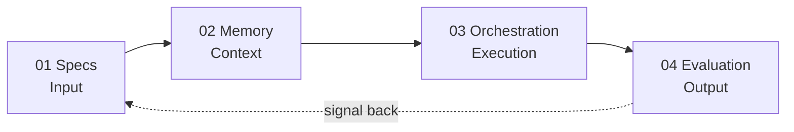

# The PM Scaffold

> The structural shape that holds up product-management work while the AI tools underneath keep changing.

---

## Why this exists

The tools we use to build with AI are changing faster than the workflows we wrap around them. Every quarter brings a new model, a new IDE, a new agent runtime. The PMs who anchor their craft to any one of them age out within a year.

The PM Scaffold is the structural shape underneath the work — **specs, memory, orchestration, evaluation** — that stays standing while the implementations rotate. You swap rungs, not the scaffold.

## The four rungs

### [01 — Specs](./01-specs/)
How a fuzzy product intent becomes something an agent can actually execute. The translation layer between human ambiguity and machine action.
**Reference implementations:** [`ears-spec-agent`](https://github.com/nich9000/ears-spec-agent) · [`prd-generator`](https://github.com/nich9000/prd-generator)

### [02 — Memory](./02-memory/)
How context persists across runs, sessions, and people. The discipline of treating institutional knowledge as a first-class artifact, not a side effect.
**Reference implementation:** [`pm-memory`](https://github.com/nich9000/pm-memory) — typed memory primitive for agentic PM work (v0 skeleton with Store / Encoder / Retriever interfaces and the master-resume extraction story as the worked example).

### [03 — Orchestration](./03-orchestration/)
How multi-step work gets composed without falling apart. The architectural choices that decide whether an agentic workflow survives complexity or collapses into prompt soup.
**Reference implementation:** [`pm-orchestration`](https://github.com/nich9000/pm-orchestration) — provider-agnostic declarative pipeline framework (v0 skeleton with Worker / Pipeline interfaces and the prd-generator extraction-story example).

### [04 — Evaluation](./04-evaluation/)
How you know any of it is actually working. The unsexy but load-bearing rung that separates demoable from shippable.
**Reference implementation:** [`pm-eval`](https://github.com/nich9000/pm-eval) — provider-agnostic eval harness (v0.1 working — Anthropic provider live, four reference rubrics, committed PRD-eval-loop example).

## The bet

Most writing about AI-augmented PM work is documenting *the current state of tools*. Those posts hit 404 by next quarter. The PM Scaffold describes the *meta-pattern* — the durable shape underneath whichever tools happen to be ascendant. When the implementations rotate (and they will, multiple times a year), the rungs stay; only the contents change.

**Structure outlasts tooling.**

## How to use this repo

If you're a PM working with AI right now, the fastest path through this repo is:

1. Read the rung directory whose work feels weakest in your current practice.
2. Look at the reference implementations linked from that rung.
3. Steal patterns. Build your own. Open an issue or PR if you want to push back on the framing.

If you're hiring or partnering, this repo is the canonical home for [the framework](https://www.linkedin.com/in/nichansen) — the READMEs of [`ears-spec-agent`](https://github.com/nich9000/ears-spec-agent), [`prd-generator`](https://github.com/nich9000/prd-generator), [`pm-memory`](https://github.com/nich9000/pm-memory), [`pm-orchestration`](https://github.com/nich9000/pm-orchestration), and [`pm-eval`](https://github.com/nich9000/pm-eval) all link back here.

## Roadmap

- [x] Framework named and defined publicly
- [x] Specs rung — two reference implementations live (`ears-spec-agent`, `prd-generator`)
- [x] Evaluation rung — reference implementation v0.1 live ([`pm-eval`](https://github.com/nich9000/pm-eval)) with committed PRD-eval-loop example
- [x] Orchestration rung — reference implementation v0 skeleton live ([`pm-orchestration`](https://github.com/nich9000/pm-orchestration))
- [x] Memory rung — reference implementation v0 skeleton live ([`pm-memory`](https://github.com/nich9000/pm-memory))
- [ ] All four rungs publicly touched ✓ — next phase is fleshing the skeletons to v0.1
- [ ] Memory rung v0.1 — working MarkdownStore + JsonStore, FreeformEncoder, TagDateRetriever
- [ ] Orchestration rung v0.1 — working Pipeline.run with topological sort + Anthropic provider
- [ ] Evaluation rung v0.2 — multi-judge consensus, additional providers
- [ ] Cross-rung integration: pm-orchestration pipelines reading/writing pm-memory between steps
- [ ] Cross-rung integration: pm-eval rubrics attached to pm-orchestration workers as quality gates
- [ ] Long-form post deep-diving each rung (one per quarter)
- [ ] Conference talk submission

## FAQ

[See `faq.md`](./faq.md) — anticipated objections, answered honestly.

## Posts

[See `posts/`](./posts/) — long-form writing on each rung as it's published.

## Author

Built and maintained by **Nic Hansen** — a future-forward PM working at the intersection of product and agentic AI. Twelve years of frontend engineering, a decade in product, currently building production agentic systems.

[LinkedIn](https://www.linkedin.com/in/nichansen) · [GitHub](https://github.com/nich9000)

## Contributing

The framework is opinionated, not closed. If you want to push back, propose a fifth rung, or contribute a reference implementation — open an issue. The best objections become FAQ entries.

## License

[MIT](./LICENSE).
